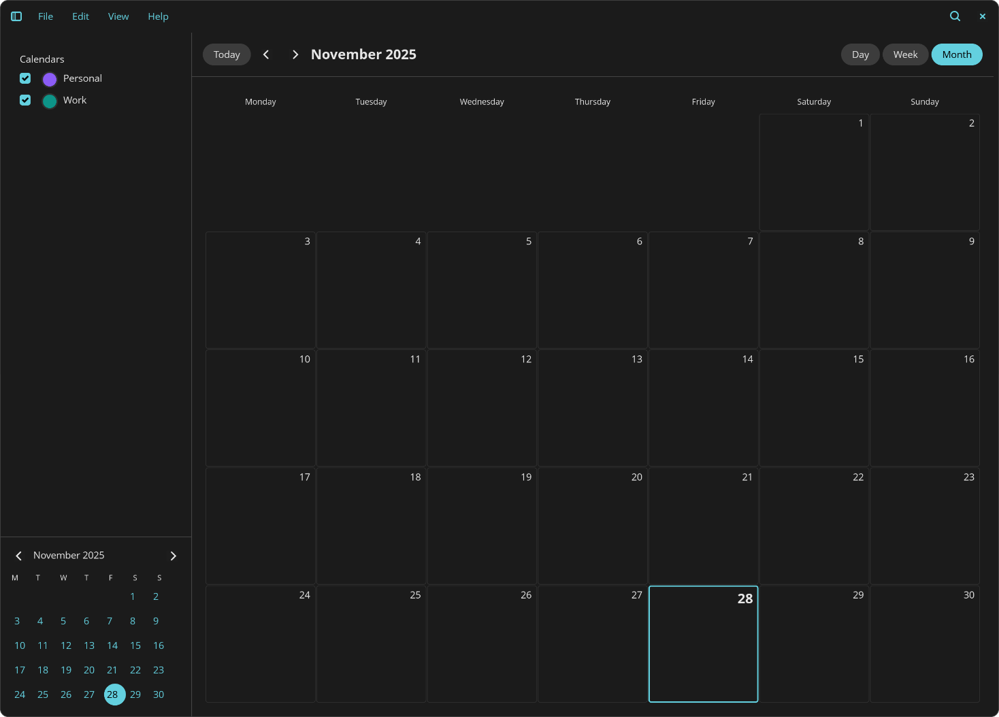
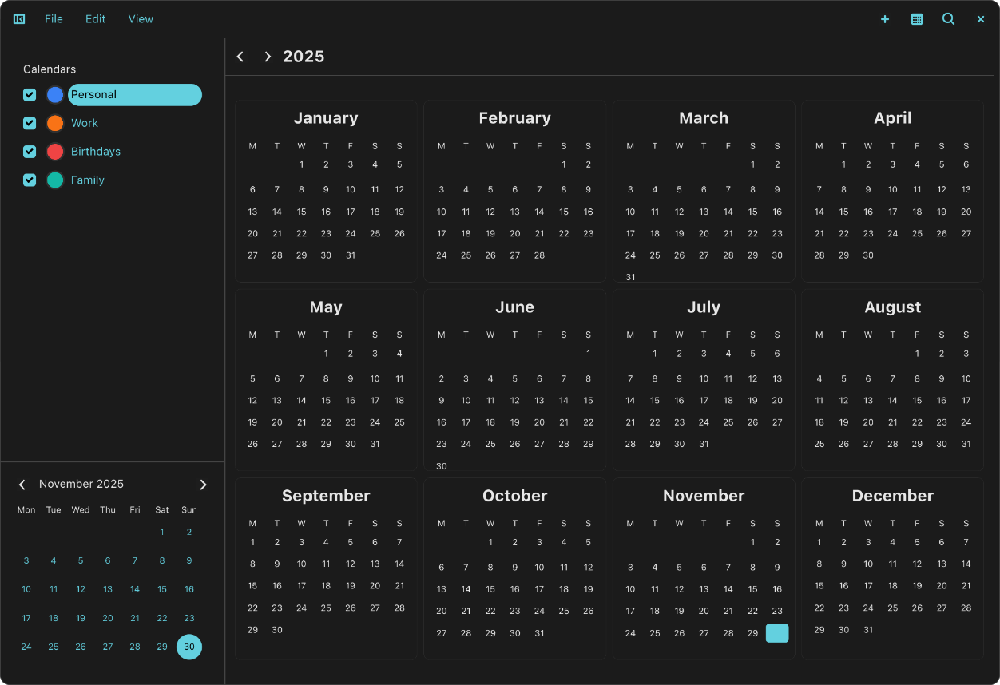

# Sol - a Calendar for the COSMIC Desktop






> ⚠️ **WORK IN PROGRESS** - This project is in early development and is **not ready for production use**. Many features are incomplete or missing. Use at your own risk!

A modern calendar application built with [libcosmic](https://github.com/pop-os/libcosmic), featuring CalDAV support for seamless calendar synchronization.

## About

Sol is a native calendar application designed for the COSMIC desktop environment. Built using libcosmic's widget system, it provides a clean, intuitive interface inspired by Apple Calendar's design while following COSMIC's design language and responsive layout patterns.

The application will support CalDAV protocol for synchronizing events with calendar servers like Nextcloud, Radicale, and other standard CalDAV-compatible services.

## Current Status

This project is in **active development**. The UI foundation is in place, but core calendar functionality is still being implemented.

### ✅ Implemented Features

#### Core UI
- Apple Calendar-inspired layout with responsive left sidebar
- Mini calendar in sidebar for quick date navigation
- Day selection with visual feedback (outlined today, filled selection)
- Square day cells with 4px rounded corners (theme-independent)
- Instant responsive UI that adapts to window size
- Sidebar overlay mode for small screens (COSMIC Files-style)
- COSMIC-style menu bar (File, Edit, View)
- Navigation controls (Previous/Next/Today buttons)

#### Multiple View Modes
- **Month View**: Full month calendar grid with week numbers (optional)
- **Week View**: Week schedule with hourly time slots and all-day events section
- **Day View**: Single day detailed schedule with hourly breakdown
- **Year View**: 12-month overview in 3×4 grid (Apple Calendar style)

#### Navigation & Controls
- View switcher buttons (Day/Week/Month/Year) in toolbar
- Keyboard shortcuts for quick navigation:
  - `Ctrl+1` - Month View
  - `Ctrl+2` - Week View
  - `Ctrl+3` - Day View
  - `Ctrl+4` - Year View
  - `Ctrl+N` - New Event (planned)

#### Localization
- System locale detection with fallback to English
- Localized month and day names
- First day of week respects locale (Monday/Sunday)
- Week number calculation (ISO 8601)
- Multiple languages supported (English, German, French, Ukrainian)

#### Calendar Management
- Multiple calendar support with color coding
- Calendar visibility toggle
- Custom color picker for calendars
- Default calendars: Personal (blue), Work (purple)

### 🚧 Work In Progress

- [ ] Event creation, editing, and deletion
- [ ] CalDAV server configuration UI
- [ ] Active CalDAV synchronization
- [ ] Event display in calendar views
- [ ] Event notifications
- [ ] Recurring events
- [ ] Background sync
- [ ] Search functionality

## Building

### Prerequisites

- Rust (latest stable version)
- libcosmic dependencies (automatically fetched from git)

### Compile

```bash
cargo build --release
```

### Run

```bash
cargo run --release
```

## Architecture

Sol follows the **Elm/MVU (Model-View-Update)** architecture pattern, which is standard for libcosmic applications:

### Module Organization

```
src/
├── app.rs                  # Main application state and COSMIC framework integration
├── main.rs                 # Entry point
├── update.rs               # Message handling and state updates
├── message.rs              # Application message enum
├── menu_action.rs          # Menu action definitions
├── keyboard.rs             # Centralized keyboard shortcuts
├── layout.rs               # Responsive layout management
│
├── models/                 # Domain models and state
│   ├── calendar_state.rs   # Month calendar state with caching
│   ├── week_state.rs       # Week view state
│   ├── day_state.rs        # Day view state
│   └── year_state.rs       # Year view state
│
├── views/                  # View rendering functions (pure functions)
│   ├── main_view.rs        # Main content coordinator
│   ├── month.rs            # Month grid view
│   ├── week.rs             # Week schedule view
│   ├── day.rs              # Day schedule view
│   ├── year.rs             # Year overview
│   └── sidebar.rs          # Sidebar layout
│
├── components/             # Reusable UI components
│   ├── day_cell.rs         # Individual day cell
│   ├── mini_calendar.rs    # Mini calendar widget
│   ├── calendar_list.rs    # Calendar list widget
│   ├── color_picker.rs     # Color selection widget
│   ├── toolbar.rs          # Navigation toolbar
│   └── header_menu.rs      # Application menu bar
│
├── calendars/              # Calendar data sources
│   ├── calendar_source.rs  # Calendar trait definition
│   ├── local_calendar.rs   # Local calendar implementation
│   ├── caldav_calendar.rs  # CalDAV calendar implementation
│   └── config.rs           # Calendar configuration
│
├── locale.rs               # Locale detection and formatting
├── localized_names.rs      # Localized month/day names
├── cache.rs                # Calendar state caching
├── caldav.rs               # CalDAV protocol support
├── storage.rs              # Local event storage
├── settings.rs             # Persistent app settings
├── layout_constants.rs     # UI layout dimensions and spacing
├── color_constants.rs      # UI color values
└── styles.rs               # Custom styles for containers
```

### Key Architecture Patterns

- **MVU Pattern**: Clean separation of Model (state), View (rendering), and Update (state transitions)
- **Pure View Functions**: All views are pure functions that take state and return UI elements
- **Centralized State**: Single source of truth in `CosmicCalendar` struct
- **Message-Based Updates**: All state changes happen through message passing
- **Caching Layer**: `CalendarCache` pre-computes calendar states for performance
- **Calendar Abstraction**: `CalendarSource` trait enables pluggable calendar backends

## Technology Stack

- **[libcosmic](https://github.com/pop-os/libcosmic)**: Modern UI framework for COSMIC desktop built on iced
- **chrono**: Date and time handling with timezone support
- **chrono-tz**: Timezone database
- **i18n-embed**: Internationalization framework
- **fluent**: Localization system (Mozilla Fluent)
- **icalendar**: iCalendar format parsing and generation
- **reqwest**: HTTP client for CalDAV operations
- **serde**: Serialization/deserialization
- **dirs**: Platform-specific directory handling
- **ron**: Rusty Object Notation for settings storage

## Planned CalDAV Support

The application will support full CalDAV protocol integration:

- Connect to any CalDAV-compatible server (Nextcloud, Radicale, etc.)
- Synchronize events bidirectionally
- Local event caching for offline access
- Support for multiple calendar accounts

### Planned CalDAV Configuration

Users will be able to configure:
1. CalDAV server URL
2. Username and password/app-specific password
3. Which calendars to sync
4. Sync interval

## Design Philosophy

- **Native COSMIC integration**: Uses libcosmic for native look and feel
- **Responsive design**: Adapts to different window sizes with instant transitions
- **Theme-independent styling**: Critical UI elements maintain consistent appearance
- **Offline-first**: Local storage with server sync
- **Privacy-focused**: Events stored locally by default

## Recent Improvements

### Architecture Refactoring (Latest)
- **Centralized keyboard shortcuts**: Single source of truth in `keyboard.rs`, eliminating duplication
- **Split UI constants**: Separated `layout_constants.rs` and `color_constants.rs` for better organization
- **Calendar initialization**: Moved default calendar creation to `CalendarManager::with_defaults()`
- **Improved maintainability**: Better separation of concerns and single responsibility principle

### Year View Implementation
- Apple Calendar-inspired 12-month grid layout (3×4)
- Today highlighting with accent color
- Localized month names
- Proper vertical scaling for consistent month sizes
- Keyboard shortcut: `Ctrl+4`

## Contributing

Contributions are welcome! However, please note that this project is in early development and the architecture may change significantly. Feel free to:

- Report bugs and issues
- Suggest features
- Submit pull requests
- Improve documentation

## License

This project is licensed under the GNU General Public License v3.0 (GPLv3). See the [LICENSE](LICENSE) file for details.

## Disclaimer

**This software is NOT ready for production use.** Features are incomplete, bugs are expected, and data loss may occur. Do not rely on this application for important calendar events at this time.
